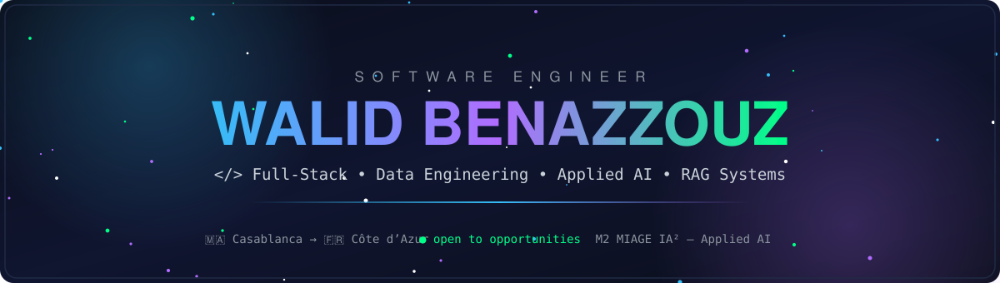
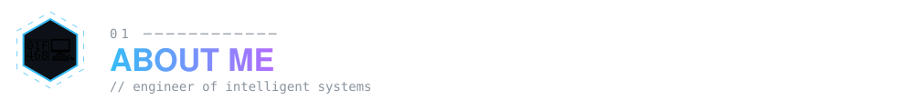
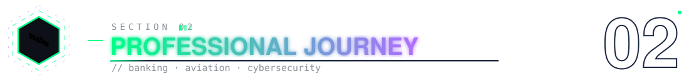
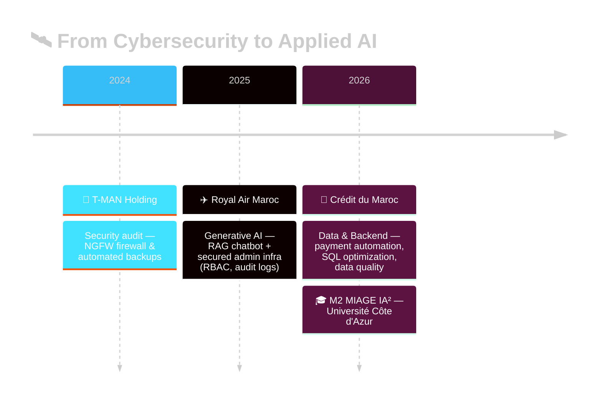
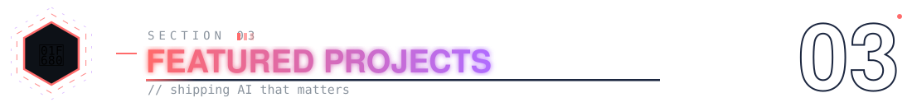
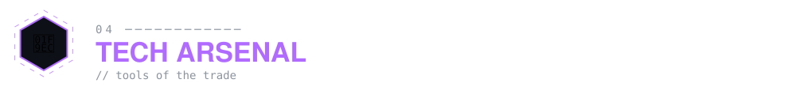
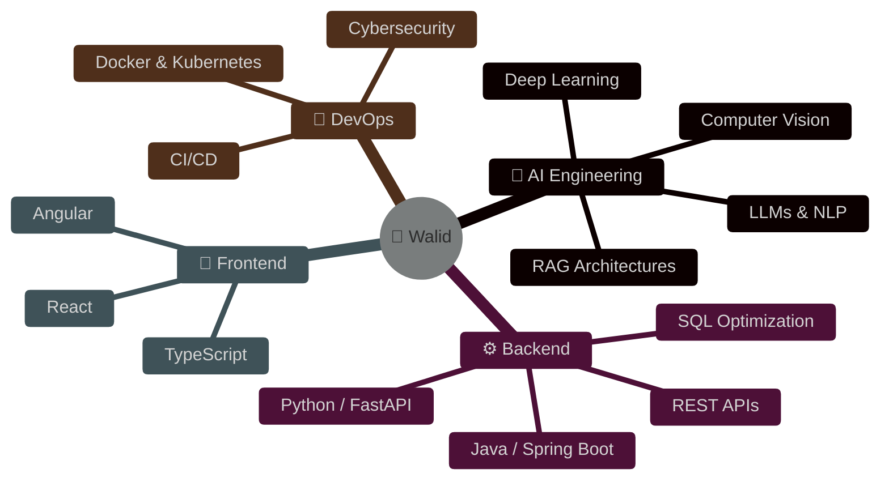
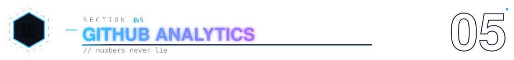
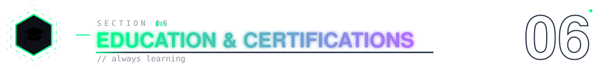
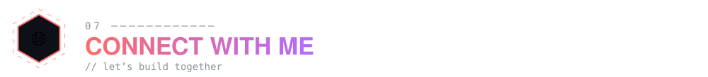

<!-- ══════════════════════════════════════════════════════════════
     ⚡ WALID BENAZZOUZ — GITHUB PROFILE
     Custom animated SVGs live in ./assets — keep the folder
     next to this README in the WalidBenazzouz/WalidBenazzouz repo.
     ══════════════════════════════════════════════════════════════ -->

<div align="center">

<!-- ⚡ CUSTOM ANIMATED HERO -->


<!-- ⚡ LIVE TYPING -->
<a href="https://git.io/typing-svg">
    
</a>

<br/>

<!-- ⚡ COUNTERS -->
<p>
    
    
    
</p>

</div>


<!-- ════════════════════════ 01 · ABOUT ════════════════════════ -->



<table>
<tr>
<td width="60%" valign="top">

```typescript
const walid: Engineer = {
    role: "Full-Stack · Data · Applied AI",
    education: {
        master: "M2 MIAGE IA² @ Université Côte d'Azur 🇫🇷",
        engineering: "Cycle Ingénieur MIAGE @ EMSI 🇲🇦",
    },
    now: {
        working: "Data & Backend @ Crédit du Maroc 🏦",
        building: "WeSelia — AI recruitment SaaS 🚀",
        learning: ["LLM fine-tuning", "K8s at scale"],
    },
    languages: {
        arabic: "native", french: "C2",
        english: "C1", german: "A1",
    },
    motto: () => "Ship intelligent systems that matter.",
};
```

</td>
<td width="40%" valign="top">

<br/>

> 🏦 **Banking** · ✈️ **Aviation** · 🤝 **HR-Tech**
> *Real AI, deployed in real industries.*

<br/>

- 🧠 **RAG architectures** in production, not tutorials
- 📊 **SQL optimization** with direct business impact
- 🔐 Security-first mindset — *auth, RBAC, audit logs*
- 🎨 Digital-art enthusiast & 🚗 mechanics lover
- ☕ Powered by coffee & curiosity

<br/>

<div align="center">

</div>

</td>
</tr>
</table>


<!-- ════════════════════════ 02 · JOURNEY ════════════════════════ -->





<details>
<summary>&nbsp; &nbsp;<em>Mar – Aug 2026 · Casablanca</em> &nbsp;▼</summary>
<br/>

- 💳 Full-stack design of a **banking app automating payment flows** — regulatory-compliant
- 📊 Led **Data Services**: advanced SQL optimization & contractual reconciliation reliability
- 📈 Data-quality improvements with **direct impact on business reporting**

&nbsp;&nbsp;`Java` `Spring Boot` `Oracle` `SQL` `REST APIs`

</details>

<details>
<summary>&nbsp; &nbsp;<em>2025 · Casablanca</em> &nbsp;▼</summary>
<br/>

- 🤖 Built a **generative-AI chatbot (RAG architecture)** for customer assistance
- 🔐 Secured admin infrastructure — **authentication, RBAC, audit logs**
- ⚡ High-performance backend APIs

&nbsp;&nbsp;`Python` `FastAPI` `React` `Groq` `LangChain`

</details>

<details>
<summary>&nbsp; &nbsp;<em>2024 · Casablanca</em> &nbsp;▼</summary>
<br/>

- 🛡️ Full IT security audit — critical vulnerabilities identified
- 🧱 Deployed **NGFW firewall** & automated backup systems

&nbsp;&nbsp;`Network Security` `Firewalls` `Backup Systems`

</details>


<!-- ════════════════════════ 03 · PROJECTS ════════════════════════ -->



<table>
<tr>
<td width="50%" valign="top">

<div align="center">

### 🚀 WeSelia
 

</div>

**AI-powered recruitment platform.** Semantic analysis of CVs & job offers matches candidates and recruiters with a **detailed, explainable compatibility score** — hiring made faster, fairer, and transparent.

- 🧠 Semantic CV ↔ job-offer skill analysis
- 📊 Explainable compatibility scoring
- ⚡ SaaS architecture, recruiter + candidate portals

</td>
<td width="50%" valign="top">

<div align="center">

### 🤖 RAG Chatbot — Royal Air Maroc
 

</div>

**Production RAG chatbot** for customer assistance, with a secure admin infrastructure managing the knowledge base and conversations.

- 🧠 Retrieval-Augmented Generation
- 🔐 Auth, RBAC & audit logging
- ⚡ Real-time interactions

</td>
</tr>
<tr>
<td width="50%" valign="top">

<div align="center">

### 🫁 Pneumonia Detection
 

</div>

**Deep-learning model detecting pneumonia on chest X-rays** — computer vision applied to medical imaging.

- 🩻 CNN-based image classification
- 📈 Trained & evaluated on radiography datasets
- 🏥 Healthcare-oriented AI

</td>
<td width="50%" valign="top">

<div align="center">

### 🎬 Cinema Management Platform
 

</div>

**Digital platform modernizing cinema operations** end-to-end.

- 🎫 Booking system
- 📊 Analytics dashboard
- 🎨 Modern UI/UX

</td>
</tr>
</table>


<!-- ════════════════════════ 04 · STACK ════════════════════════ -->



<div align="center">

### ⚙️ Core Stack


### 🤖 AI & Data

<br/>


### 🔧 DevOps & Cloud &nbsp;·&nbsp; 🗄️ Databases

<br/>


</div>

<br/>




<!-- ════════════════════════ 05 · ANALYTICS ════════════════════════ -->



<div align="center">
  
  
  <br/>
  
  <br/><br/>
  
  <br/><br/>
  
  <br/><br/>
  
</div>


<!-- ════════════════════════ 06 · EDUCATION ════════════════════════ -->



<table>
<tr>
<td width="50%" valign="top">

### 🎓 Education
- 🇫🇷 **M2 MIAGE IA² — Applied AI**
  <sub>Université Côte d'Azur · 2025 – 2026</sub>
- 🇲🇦 **Cycle Ingénieur MIAGE**
  <sub>EMSI Casablanca · 2025 – 2026</sub>
- 📐 **Cycle Préparatoire Intégré**
  <sub>EMSI Casablanca · 2021 – 2024</sub>

</td>
<td width="50%" valign="top">

### 📜 Certifications
- ☁️ **Oracle APEX Cloud Developer** <sub>· Oracle University</sub>
- 🐳 **Docker & Kubernetes** <sub>· IBM</sub>
- 🐍 **Programming with Python** <sub>· University of Michigan</sub>
- ☕ **Java & OOP** <sub>· University of Pennsylvania</sub>
- 💾 **SQL Mastery** <sub>· University of Colorado Boulder</sub>
- 🏗️ **Software Engineering** <sub>· Hong Kong University</sub>

</td>
</tr>
</table>

<div align="center">


</div>


<!-- ════════════════════════ 07 · CONNECT ════════════════════════ -->



<div align="center">

<a href="mailto:Benazzouz.walid@outlook.com"></a>
&nbsp;
<a href="https://www.linkedin.com/in/walid-ben-azzouz/"></a>
&nbsp;
<a href="https://github.com/WalidBenazzouz"></a>
&nbsp;
<a href="https://www.instagram.com/walid_benazzouz/"></a>
&nbsp;
<a href="https://discord.com/users/walid_benazzouz"></a>

<br/><br/>


<br/>

###  Let's build something amazing together

<em>Collaborations in <b>AI</b>, <b>Data Engineering</b> & <b>Full-Stack</b> — or just a tech chat over ☕</em>

<br/><br/>

⭐ <em>Show some love by starring a repository!</em> ⭐

</div>

<!-- ⚡ ANIMATED FOOTER -->

